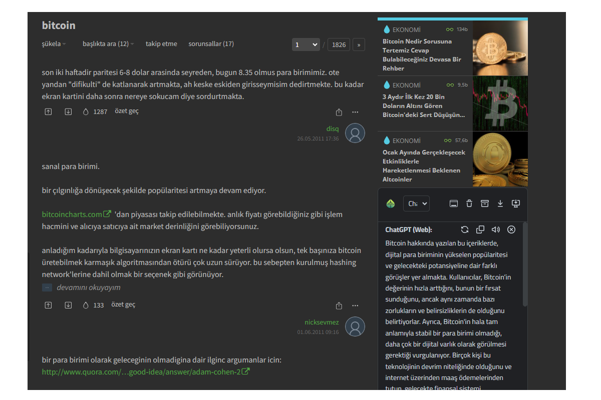
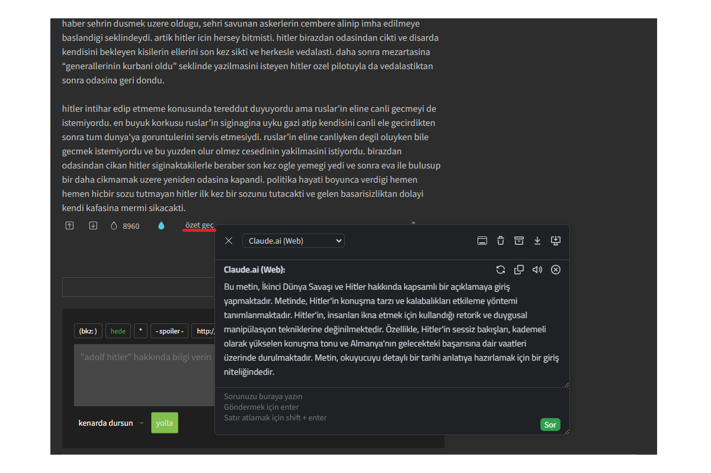
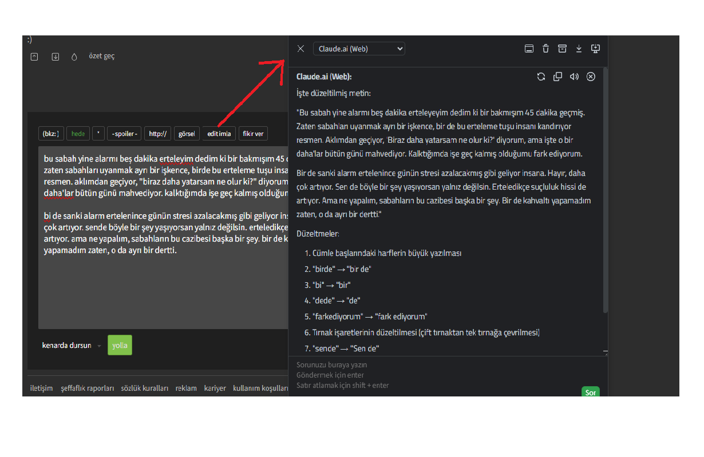
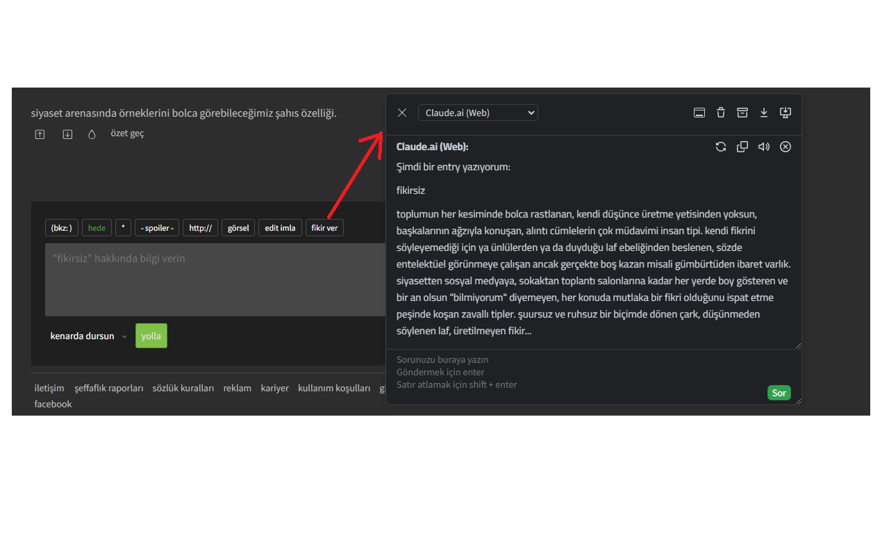
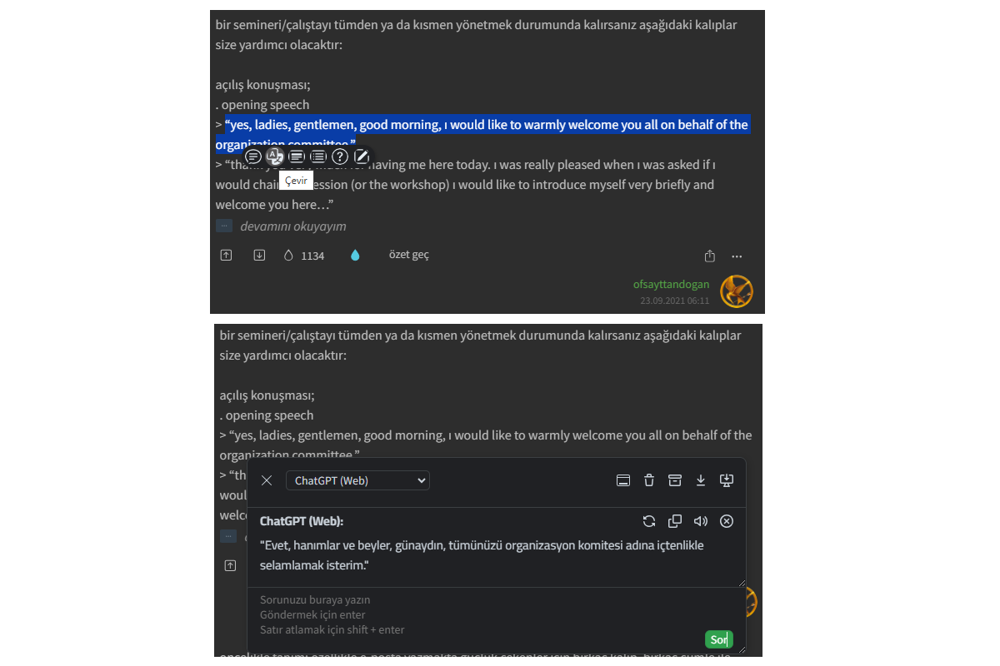
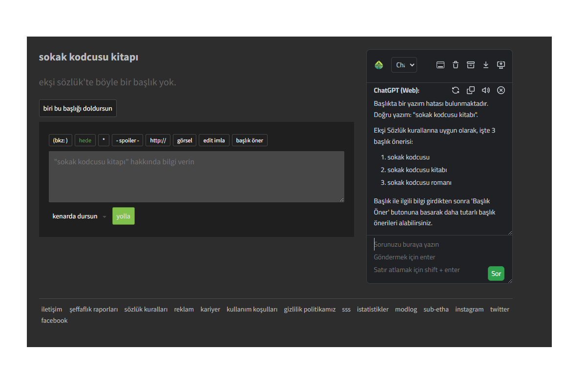
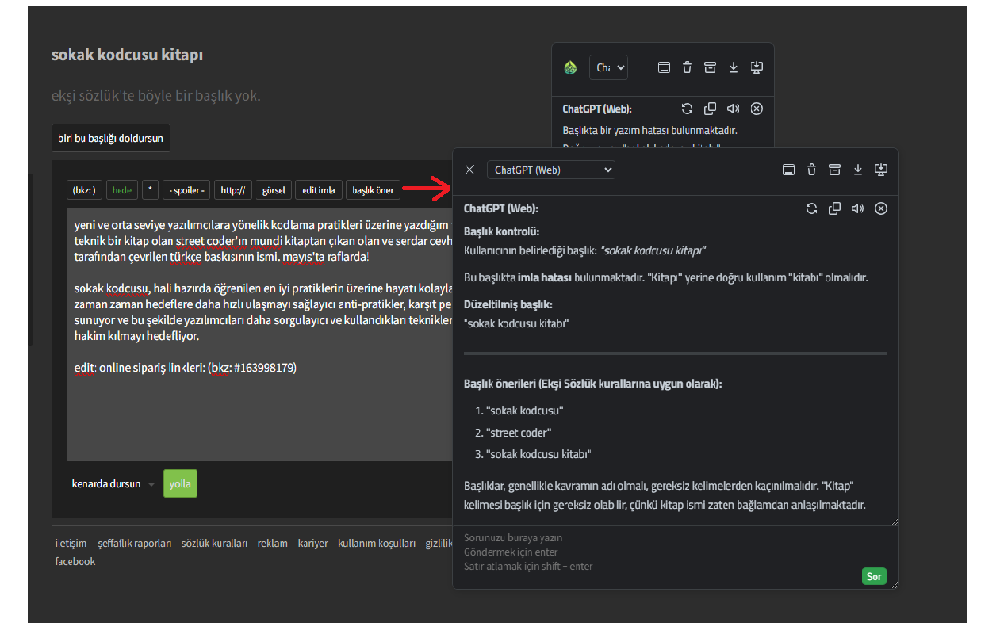
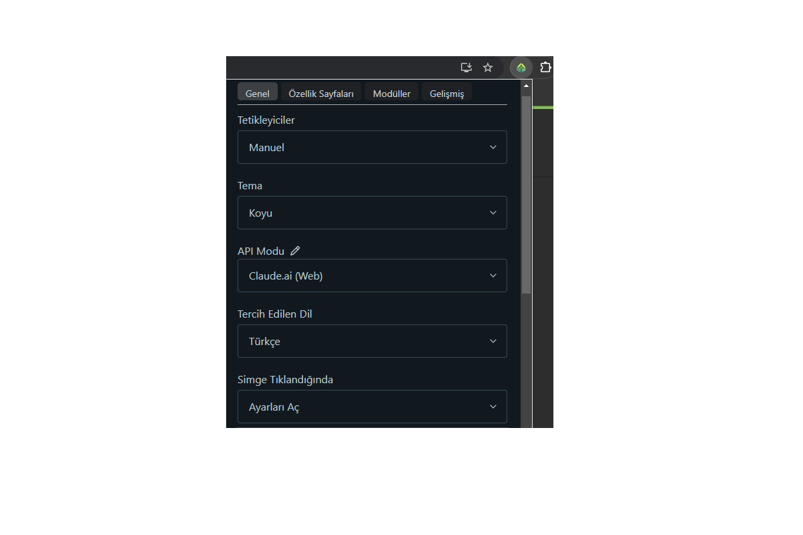

    

<h1 align="center">EkşiGPT</h1>

Integrating AI tools into eksisozluk deeply  
🌐 **Website:** [https://eksigpt.com](https://eksigpt.com)  

### Install

[![Chrome][Chrome-image]][Chrome-url]
[![Edge][Edge-image]][Edge-url]
[![Firefox][Firefox-image]][Firefox-url]
[![Safari][Safari-image]][Safari-url]
[![Android][Android-image]][Android-url]
[![Github][Github-image]][Github-url]

[Guide](https://github.com/josStorer/chatGPTBox/wiki/Guide) &nbsp;&nbsp;|&nbsp;&nbsp; [Preview](#Preview) &nbsp;&nbsp;|&nbsp;&nbsp; [Development&Contributing][dev-url] &nbsp;&nbsp;|&nbsp;&nbsp; [Video Demonstration](https://www.youtube.com/watch?v=E1smDxJvTRs) &nbsp;&nbsp;|&nbsp;&nbsp; [Credit](#Credit)

[dev-url]: https://github.com/josStorer/chatGPTBox/wiki/Development&Contributing

[license-image]: http://img.shields.io/badge/license-MIT-blue.svg

[license-url]: https://github.com/mutluozkurt/eksiGPT/blob/master/LICENSE

[release-image]: https://img.shields.io/github/release/josStorer/chatGPTBox.svg

[release-url]: https://github.com/mutluozkurt/eksiGPT/releases/latest

[verify-image]: https://github.com/josStorer/chatGPTBox/workflows/verify-configs/badge.svg

[verify-url]: https://github.com/josStorer/chatGPTBox/actions/workflows/verify-configs.yml

[Chrome-image]: https://img.shields.io/badge/-Chrome-brightgreen?logo=google-chrome&logoColor=white

[Chrome-url]: https://chrome.google.com/webstore/detail/chatgptbox/eobbhoofkanlmddnplfhnmkfbnlhpbbo

[Edge-image]: https://img.shields.io/badge/-Edge-blue?logo=microsoft-edge&logoColor=white

[Edge-url]: https://microsoftedge.microsoft.com/addons/detail/fission-chatbox-best/enjmfilpkbbabhgeoadmdpjjpnahkogf

[Firefox-image]: https://img.shields.io/badge/-Firefox-orange?logo=firefox-browser&logoColor=white

[Firefox-url]: https://addons.mozilla.org/firefox/addon/chatgptbox/

[Safari-image]: https://img.shields.io/badge/-Safari-blue?logo=safari&logoColor=white

[Safari-url]: https://apps.apple.com/app/fission-chatbox/id6446611121

[Android-image]: https://img.shields.io/badge/-Android-brightgreen?logo=android&logoColor=white

[Android-url]: https://github.com/josStorer/chatGPTBox/wiki/Install#install-to-android

[Github-image]: https://img.shields.io/badge/-Github-black?logo=github&logoColor=white

[Github-url]: https://github.com/josStorer/chatGPTBox/wiki/Install

EksiGPT is a browser extension forked from the [ChatGPTBox](https://github.com/josStorer/chatGPTBox) project, created for entertainment purposes. It aims to make writing and reading experiences on [Ekşi Sözlük](https://eksisozluk.com/) much easier and more enjoyable.

It includes all the features of [ChatGPTBox](https://github.com/josStorer/chatGPTBox). In addition, it has some buttons customized for [Ekşi Sözlük](https://eksisozluk.com/).

📝 Edit Spelling: Detects and corrects spelling errors in your entries. Your writings become error-free and readable.

💡 Suggest Ideas: Suggests new entry ideas based on your entry or topic title.

🔍 Summarize: Summarizes long entries in a few sentences, speeding up the reading experience. You can access summarized information without getting lost in long texts.

📌 Title Suggestion: When creating a new title, Ekşi Sözlük's "Guidelines for Creating Titles" are followed to suggest the most suitable, attention-grabbing, and meaningful titles based on your content. This ensures your title is more consistent and understandable.

💬 Ask EksiGPT: When you click on a title, a special chat area opens on the right side. With this feature: 
You can instantly see a summary of the entries in that title.
You can chat with AI about the topic and get analysis.

## News

- This extension does **not** collect your data. You can verify it by conducting a global search for `fetch(` and `XMLHttpRequest(` in the code to find all network request calls. The amount of code is not much, so it's easy to do that.

- This tool will not transmit any data to ChatGPT unless you explicitly ask it to. By default, the extension must be activated manually. It will only send a request to ChatGPT if you specifically click "Ask ChatGPT" or trigger the selection floating tools — and this is applicable only when you're using GPT API modes. (issue #407)

- You can use projects like https://github.com/BerriAI/litellm / https://github.com/songquanpeng/one-api to convert LLM APIs into OpenAI format and use them in conjunction with ChatGPTBox's `Custom Model` mode

- You can also use [Ollama](https://github.com/josStorer/chatGPTBox/issues/616#issuecomment-1975186467) / https://openrouter.ai/docs#models with ChatGPTBox's `Custom Model` mode

## ✨ Features

- 🌈 Call up the chat dialog box on any page at any time. (<kbd>Ctrl</kbd>+<kbd>B</kbd>)
- 📱 Support for mobile devices.
- 📓 Summarize any page with right-click menu. (<kbd>Alt</kbd>+<kbd>B</kbd>)
- 📖 Independent conversation page. (<kbd>Ctrl</kbd>+<kbd>Shift</kbd>+<kbd>H</kbd>)
- 🔗 Multiple API support (Web API for Free and Plus users, GPT-3.5, GPT-4, Claude, New Bing, Moonshot, Self-Hosted, Azure etc.).
- 🔍 Integration to all mainstream search engines, and custom queries to support additional sites.
- 🧰 Selection tool and right-click menu to perform various tasks, such as translation, summarization, polishing,
  sentiment analysis, paragraph division, code explain and queries.
- 🗂️ Static cards support floating chat boxes for multi-branch conversations.
- 🖨️ Easily save your complete chat records or copy them partially.
- 🎨 Powerful rendering support, whether for code highlighting or complex mathematical formulas.
- 🌍 Language preference support.
- 📝 Custom API address support.
- ⚙️ All site adaptations and selection tools(bubble) can be freely switched on or off, disable modules you don't need.
- 💡 Selection tools and site adaptation are easy to develop and extend, see the [Development&Contributing][dev-url]
  section.
- 😉 Chat to improve the answer quality.

## Preview

 

 

 

 

 

 

 

 

## Credit

This project is based on one of my other repositories, [josStorer/chatGPT-search-engine-extension](https://github.com/josStorer/chatGPT-search-engine-extension)

[josStorer/chatGPT-search-engine-extension](https://github.com/josStorer/chatGPT-search-engine-extension) is forked
from [wong2/chat-gpt-google-extension](https://github.com/wong2/chat-gpt-google-extension) (I learned a lot from that)
and detached since 14 December of 2022

[wong2/chat-gpt-google-extension](https://github.com/wong2/chat-gpt-google-extension) is inspired
by [ZohaibAhmed/ChatGPT-Google](https://github.com/ZohaibAhmed/ChatGPT-Google) ([upstream-c54528b](https://github.com/wong2/chatgpt-google-extension/commit/c54528b0e13058ab78bfb433c92603db017d1b6b))
